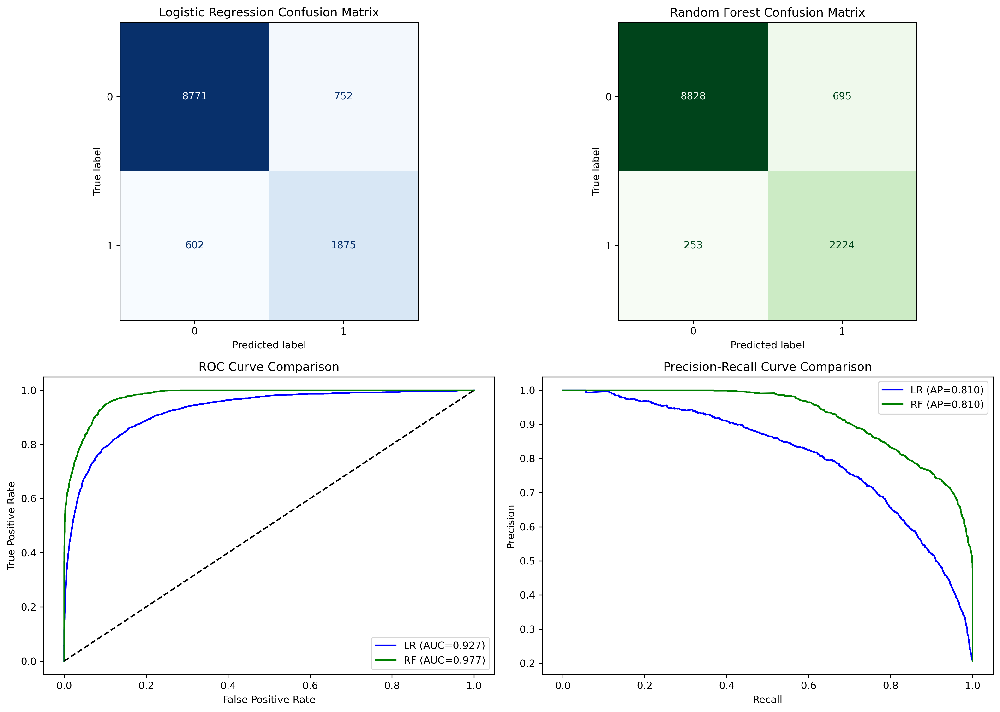

# 📊 Churn Prediction App

An interactive machine learning application built with **Streamlit**, **scikit-learn**, and **PostgreSQL (Neon)** to predict customer churn and analyze prediction trends.  
The app provides real-time predictions, telemetry logging (latency, model version, status), and dashboards for monitoring model performance.

**Live Application:** [View Live Streamlit App](https://churn-prediction-1827.streamlit.app/)

---

## 🚀 Features
- **Prediction Page**  
  - User-friendly input form for customer attributes  
  - One-click **Run Prediction** button  
  - Displays churn probability and prediction outcome  
  - Saves telemetry + prediction data to Neon database

- **Prediction Trends Page**  
  - Interactive Plotly graphs for latency trends, prediction probabilities, and churn distribution  
  - SQL joins telemetry with prediction data for analysis

---

## 🛠️ Tech Stack
- **Frontend**: Streamlit  
- **Backend**: Python (scikit-learn, psycopg2)  
- **Database**: PostgreSQL (Neon)  
- **Visualization**: Plotly, Pandas  

---

## 📂 Project Structure
```
Churn Prediction/
├── .streamlit
├── Assets/
├── pages/             
├── .gitignore
├── Churn Model Creation.ipynb  
├── db_init.py
├── db_pool.py
├── Home.py
├── random_forest_pipeline.pkl
├── README.md
├── requirements.txt
└── rf_best_threshold
```

---

## ⚙️ Setup Instructions
1. **Clone the repository**
   ```bash
   git clone https://github.com/yourusername/churn-prediction.git
   cd churn-prediction
   ```

2. **Install Dependencies**
   ```bash
   pip install -r requirements.txt
   ```

3. **Run the app**
   ```bash
   streamlit run Home.py
   ```

4. **The Prediction trends will not run on your pc even if you are cloning this repository.**

## Model Creation

1. Initially a simple logistic regression model was created to see if the results align with the EDA.
🔗 **Customer Churn Dashboard** [View Live Dashboard](https://public.tableau.com/views/Book1_17908709037120/CustomerChurnDashboard?:language=en-US&:sid=&:redirect=auth&:display_count=n&:origin=viz_share_link)

2. Then best threshold and hyperparameters were fixed to ensure best model performance.

3. Finally a logistic regression model and a random forest model was created with updated hyperparameters, here is the comparison of both models.

